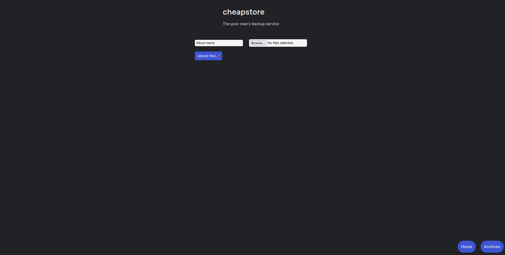

# cheapstore 🤑
A simple solution for storing backups.

Have you had enough of paying for storage services? Are you afraid that your files are in the wrong hands?  
If yes, then this project is for you.

## Use cases
- One can upload their images from a remote device and download later.
- File sharing over WAN / LAN

## Usage
It can be deployed locally and on vercel.
- Run `npm ci` to install all packages
- Run `node index.js` to start up the server.

Simply select files and upload them. The program will put every file into a `zip` and will store it on **YOUR** computer *(or on the host server)*.    
The zip archives will be stored in `public/backups`.